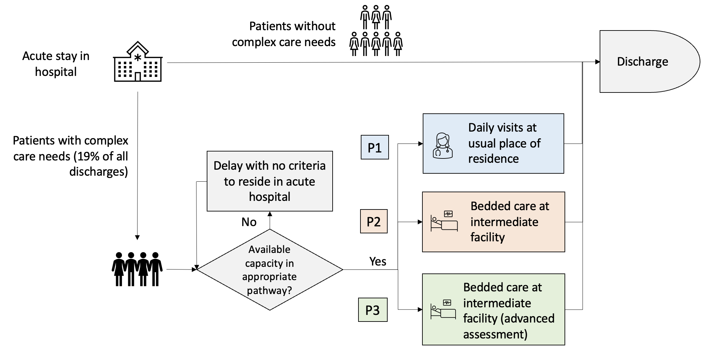
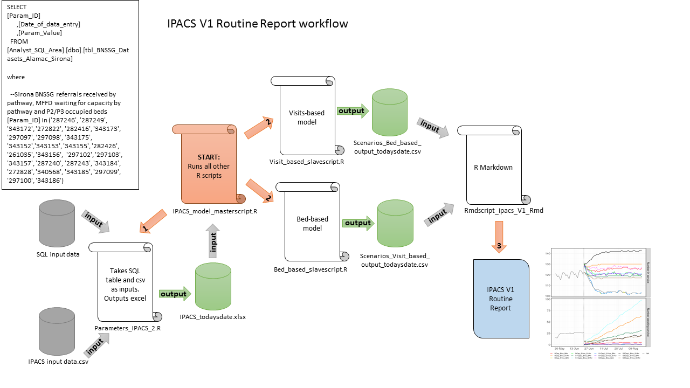

---
output:
  word_document
title: "BNSSG D2A: P1/P2/P3 Capacity Planning"
author: "Improving Patient Flow between Acute, Community and Social Care (IPACS). For more information, please contact Rich Wood (richard.wood16@nhs.net)"
date: '`r format(Sys.time(), "%d %B, %Y")`'
---

```{r setup-, include=FALSE}
knitr::opts_chunk$set(echo = FALSE)
library(here)
library(knitr)
library(flextable)
```

```{r import_res}
# Import outputs from bed-based and visit-based scenarios
# Use "here" package to create relative file path that works on all systems
# Depends on input_filename from ipacs_main_script.R
output_suffix <- paste0("_output_using_",
                        gsub(".xlsx", "", input_filename), ".csv")
bed_data <- read.csv(here("outputs", "report_data", 
                          paste0("bed", output_suffix)))
visit_data <- read.csv(here("outputs", "report_data", paste0("visit", output_suffix)))
```

### The IPACS model
* The IPACS model simulates flows of patients from acute discharge into the three D2A complex care pathways by locality.  
* This report outputs a range of pre-defined scenarios for a `r nrow(visit_data)`-day (`r round(nrow(visit_data)/30)` months) period.  
* Scenarios model the impact of varying acute referral patterns into D2A pathways, length of stay (LoS) in each pathway, and capacity in pathway.  
* For each day in the `r nrow(visit_data)`-day period and for each pathway, the model estimates the mean number of patients in service, the mean number of acute patients delayed, and the mean number of days patients are delayed under given capacity constraints.  

### IPACS models the following processes at the locality level:  
    
  
### The workflow for creating this document is as follows:
  

### Model Scenarios

For each locality in BNSSG, and for each of P1, P2 and P3, modelled parameters and scenario combinations are displayed in the following two pages.  

The subsequent pages output 9 sets of plots, each displaying the `r (ncol(bed_data)-1)/24` scenario combinations for each of:  

  * Number in service - the number of patients estimated to be utilising the service given service capacity;  
  
  * Number awaiting service - the number of patients estimated to be delayed in the acute sector awaiting D2A;  
  
  * Mean days delayed - the mean number of days delayed in the acute sector;
  
  * Costs - total system cost (acute delay cost + community service cost).

\newpage

### *Referrals:*  
Referral patterns are based on the mean numbers of referrals for the past six months split by pathway and locality.

  * **BArr** *Baseline referrals*  
```{r BArr-plot,warning=FALSE, eval=TRUE, echo=FALSE, fig.height=4, fig.width=8}
# Function for generating plot of arrivals data
# Inputs:
# arrs - dataframe arrivals on each data for each pathway and location
# Outputs:
# arr_plot - image with arrivals in each pathway and location for baseline or
# scenario
arr_plots <- function(arrs) {
  arr_plot <- ggplot(arrs, aes_string(x = "date", y = "arrivals")) +
    theme_bw() +
    ylab("Daily referrals") +
    labs(fill = "Scenario") +
    geom_line(aes(color = name))
  return(arr_plot)
}

# Currently depends on prior scripts

# Create baseline arrivals plot using arr_plots()
arrivals_all$name <- paste0(arrivals_all$node, "_", arrivals_all$scenario)
barr <- arrivals_all %>% filter(grepl("BArr", name))
arr_plots(barr)
```

  * **S1Arr** *Scenario 1 referrals*  
```{r SArr-plot, warning=FALSE, eval=TRUE, echo=FALSE, fig.height=4, fig.width=8}
# Create scenario arrivals plot using arr_plots()
sarr <- arrivals_all %>% filter(grepl("S1Arr", name))
arr_plots(sarr)
```

\newpage

```{r table}
# Create dataframe with one row per pathway and columns containing the values
# for capacity and mean length of stay at baseline and for each scenario
info_table_cap <- capacity %>%
  select(node, scenario, capacity) %>%
  pivot_wider(names_from = "scenario", values_from = "capacity") %>%
  mutate(S1Cap = replace(S1Cap, S1Cap == "2000", "Unrestricted"))

info_table_los <- losA %>%
  select(node, scenario, mean_los) %>%
  mutate(mean_los = round(mean_los, 1)) %>%
  pivot_wider(names_from = "scenario", values_from = "mean_los")

info_table_merge <- merge(info_table_cap, info_table_los) %>%
  rename(Locality = node,
         `Baseline Capacity` = BCap,
         `Target Capacity` = S1Cap,
         `Baseline LoS` = Blos,
         `Target LoS` = S1los,
         `Interim LoS` = S2los)

# Convert into flextable, add header, optimise heights + widths, then display
info_table_ft <- flextable(info_table_merge)
info_table_ft <- add_header_lines(info_table_ft,
  values = "Capacity and Length of Stay Scenario Parameters")
info_table_ft <- autofit(info_table_ft)
info_table_ft
```

```{r select-data,warning=FALSE, eval=TRUE, echo=FALSE}
# Process data so it can be used for plotting

# Convert date columns to Date format
bed_data$date <- as.Date(bed_data$date)
visit_data$date <- as.Date(visit_data$date)

# Set colour palette (just 12 colours as should not run more than 12 scenarios)
cbpalette <- c("#FF0F0F", "#FF7E01", "#DDDD00", "#01FF01",
               "#007540", "#83FFFF", "#007CFF", "#7900FF",
               "#FF70FF", "#000000", "#818181", "#9A6B3F")

# Function aim:
# Select date column, plus all columns for a given pathway and location
# Remove the name of the pathway and location from the column names
# Pivot so that have row for each date/scenario/measure/value
# e.g. 1st Dec 2022, particular scenario, measure niq, value 70
# Inputs:
# sim_res - dataframe with results from simulation (visit_data or bed_data)
# path_loc - string with pathway and location (e.g. "P1_LocA")
# Output:
# sim_res_subset - subset of sim_res dataframe
create_plot_df <- function(sim_res, path_loc) {
  sim_res_subset <- sim_res %>%
    select(date, contains(path_loc)) %>%
    rename_with(~ str_remove(., paste0(path_loc, "_")), everything()) %>%
    pivot_longer(cols = !date,
                 names_sep = "__",
                 values_to = "value",
                 names_to = c("scenario", "measure"))
  return(sim_res_subset)
}
```

```{r format-plot,warning=FALSE, eval=TRUE, echo=FALSE}
# Function to generate plots for each locality
# Inputs:
# pathway_data - dataframe generated by create_plot_df
# path_loc - e.g. "P1_B"
# Outputs:
# plot - figure
plots <- function(pathway_data, path_loc) {
  # Create plots
  plot <- pathway_data %>%
    mutate(measure = factor(measure,
                            levels = c("occ", "niq", "wait", "cost"))) %>%
    mutate(measure = recode(measure,
                            occ = "Mean patients in service",
                            niq = "Mean patients delayed in acute",
                            wait = "Mean days delayed",
                            cost = "Mean system cost")) %>%
    ggplot(aes(x = date, y = value,
               color = factor(scenario)), linetype = factor(scenario)) +
    scale_colour_manual(labels = paste0("Scenario ", 1:12),
                        values = cbpalette) +
    theme_bw() +
    theme(
      panel.border = element_rect(fill = NA,
                                  color = "grey50",
                                  size = 3.5,
                                  linetype = "solid"),
      legend.position = "bottom",
      legend.title = element_blank(),
      strip.text.x = element_text(size = 12, margin = margin()),
      axis.text = element_text(size = 10),
      legend.text = element_text(size = 12),
      text = element_text(size = 15, margin = margin()),
      axis.title.x = element_blank(),
      axis.title.y = element_blank()) +
    geom_line(lwd = 0.9, position = position_dodge(width = 0.1)) +
    scale_x_date(date_breaks = "2 week",
                 date_minor_breaks = "1 day",
                 date_labels = "%d-%b") +
    facet_grid(measure ~ ., scales = "free")
  return(plot)
}

# Function to create plot df and then plot
create_plot <- function(sim_res, path_loc) {
  plot_df <- create_plot_df(sim_res, path_loc)
  plots(plot_df, path_loc)
}
```

\newpage  

## Scenarios
```{r scenarios}
# Create results table for a location, to use as basis for scenario
p1_bristol_l <- create_plot_df(visit_data, "P1_B")

# Find distinct scenarios, save into table along with column of numbers
scenario_array <- levels(factor(p1_bristol_l$scenario))
new_table <- str_split(scenario_array, "_", simplify = TRUE)
scenario_table <- cbind(c(seq_along(scenario_array)), new_table)

# Remove "cap" etc. so just left with B, S1 or S2, then rename columns
scenario_table <- gsub("Cap|los|Arr", "", scenario_table)
colnames(scenario_table) <- c("Scenario #", "Capacity",
                              "Length of Stay", "Arrival")

# Convert to dataframe, and replace "B", "S1" and "S2" labels
scenario_table <- as.data.frame(scenario_table)
scenario_table[scenario_table == "B"] <- "Baseline"
scenario_table[scenario_table == "S1"] <- "Target"
scenario_table[scenario_table == "S2"] <- "Interim"

# Convert to flextable and autofit to set appropriate column widths
tb <- flextable(scenario_table)
tb <- autofit(tb)
tb
```

\newpage

## P1 Bristol
```{r P1-B, warning=FALSE, eval=TRUE, echo=FALSE, fig.height=12, fig.width=10}
create_plot(visit_data, "P1_B")
```  

\newpage

## P1 North Somerset
```{r P1-NS,warning=FALSE, eval=TRUE, echo=FALSE, fig.height=12, fig.width=10}
create_plot(visit_data, "P1_NS")
```  

\newpage

## P1 South Gloucestershire
```{r P1-SG, warning=FALSE, eval=TRUE, echo=FALSE, fig.height=12, fig.width=10}
create_plot(visit_data, "P1_SG")
```

\newpage  
## P2 Bristol
```{r P2-B, warning=FALSE, eval=TRUE, echo=FALSE, fig.height=12, fig.width=10}
create_plot(bed_data, "P2_B")
```  

\newpage
## P2 North Somerset
```{r P2-NS, warning=FALSE, eval=TRUE, echo=FALSE, fig.height=12, fig.width=10}
create_plot(bed_data, "P2_NS")
```  

\newpage
## P2 South Gloucestershire
```{r P2-SG, warning=FALSE, eval=TRUE, echo=FALSE, fig.height=12, fig.width=10}
create_plot(bed_data, "P2_SG")
```  

\newpage

## P3 Bristol
```{r P3-B, warning=FALSE, eval=TRUE, echo=FALSE, fig.height=12, fig.width=10}
create_plot(bed_data, "P3_B")
```  


## P3 North Somerset
```{r P3-NS, warning=FALSE, eval=TRUE, echo=FALSE, fig.height=12, fig.width=10}
create_plot(bed_data, "P3_NS")
```  

## P3 South Gloucestershire
```{r P3-SG, warning=FALSE, eval=TRUE, echo=FALSE, fig.height=12, fig.width=10}
create_plot(bed_data, "P3_SG")
```  


